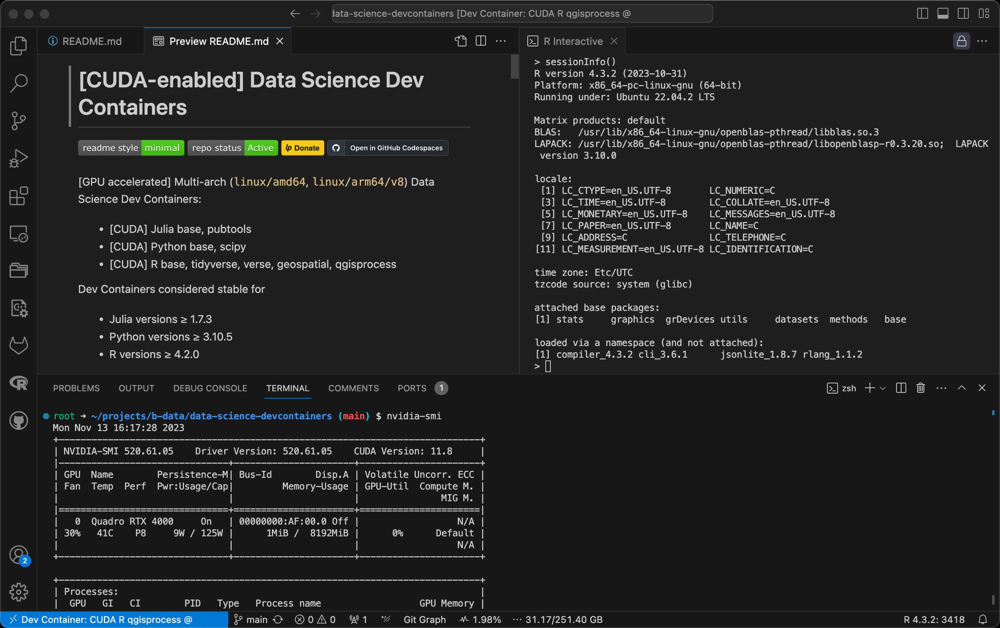

# \[CUDA-enabled\] Data Science Dev Containers

<!-- markdownlint-disable line-length -->
   
<!-- markdownlint-enable line-length -->

\[GPU accelerated\] Multi-arch (`linux/amd64`, `linux/arm64/v8`) Data Science
Dev Containers:

* \[CUDA\] Julia base, pubtools
* Mojo base, scipy
* \[CUDA\] Python base, scipy
* \[CUDA\] R base, tidyverse, verse, geospatial, qgisprocess

Dev Containers considered stable for

* Julia versions ≥ 1.7.3
* Mojo versions ≥ 24.3.0
* Python versions ≥ 3.10.5
* R versions ≥ 4.2.0

**Parent images**

* \[CUDA-enabled\] [Julia docker stack](https://github.com/b-data/julia-docker-stack)
* [Mojo docker stack](https://github.com/b-data/mojo-docker-stack)
* \[CUDA-enabled\] [Python docker stack](https://github.com/b-data/python-docker-stack)
* \[CUDA-enabled\] [R docker stack](https://github.com/b-data/r-docker-stack)

Extended to match the \[CUDA-enabled\] [Jupyter](https://github.com/b-data/jupyterlab-julia-docker-stack)[Lab](https://github.com/b-data/jupyterlab-mojo-docker-stack)
[docker](https://github.com/b-data/jupyterlab-python-docker-stack)
[stacks](https://github.com/b-data/jupyterlab-r-docker-stack), except that

* GPU accelerated Dev Containers are based on the
  [NVIDIA CUDA](https://hub.docker.com/r/nvidia/cuda) **runtime** flavoured
  image.
  * The JupyterLab docker stacks are based on the NVIDIA CUDA **devel**
    flavoured image.
* Dev Containers' Oh My Zsh uses the **devcontainers theme + default font**.
  * The JupyterLab docker stacks' Oh My Zsh uses **Powerlevel10k theme +**
    **MesloLGS NF font**.

<b>Features</b>

* **JupyterLab**: A web-based interactive development environment for Jupyter
  notebooks, code, and data.
* **Git**: A distributed version-control system for tracking changes in source
  code.
* **Git LFS**: A Git extension for versioning large files.
* **GRASS GIS**: A free and open source Geographic Information System (GIS).  
  :information_source: R qgisprocess image
* **Orfeo Toolbox**: An open-source project for state-of-the-art remote
  sensing.  
  :information_source: R qgisprocess image (amd64 only)
* **Julia**[^1]: A high-level, high-performance dynamic language for technical
  computing.
* **Mojo**[^1]: A programming language for AI developers.
* **Pandoc**: A universal markup converter.
* **Python**: An interpreted, object-oriented, high-level programming language
  with dynamic semantics.
* **QGIS**: A free, open source, cross platform (lin/win/mac) geographical
  information system (GIS).  
  :information_source: R qgisprocess image
* **Quarto**: A scientific and technical publishing system built on Pandoc.  
  :information_source: Julia pubtools, Mojo/Python scipy, R verse+ images
* **R**[^1]: A language and environment for statistical computing and graphics.
* **SAGA GIS**: A Geographic Information System (GIS) software with immense
  capabilities for geodata processing and analysis.  
  :information_source: R qgisprocess image
* **TinyTeX**: A lightweight, cross-platform, portable, and easy-to-maintain
  LaTeX distribution based on TeX Live.  
  :information_source: Julia pubtools, Mojo/Python scipy, R verse+ images
* **Zsh**: A shell designed for interactive use, although it is also a powerful
  scripting language.

:point_right: See the Version Matrices for detailed information:

* Julia: [Version Matrix](https://github.com/b-data/jupyterlab-julia-docker-stack/blob/main/VERSION_MATRIX.md),
  [CUDA Version Matrix](https://github.com/b-data/jupyterlab-julia-docker-stack/blob/main/CUDA_VERSION_MATRIX.md)
* Mojo: [Version Matrix](https://github.com/b-data/jupyterlab-mojo-docker-stack/blob/main/VERSION_MATRIX.md)
* Python: [Version Matrix](https://github.com/b-data/jupyterlab-python-docker-stack/blob/main/VERSION_MATRIX.md),
  [CUDA Version Matrix](https://github.com/b-data/jupyterlab-python-docker-stack/blob/main/CUDA_VERSION_MATRIX.md)
* R: [Version Matrix](https://github.com/b-data/jupyterlab-r-docker-stack/blob/main/VERSION_MATRIX.md),
  [CUDA Version Matrix](https://github.com/b-data/jupyterlab-r-docker-stack/blob/main/CUDA_VERSION_MATRIX.md)

<b>Pre-installed extensions</b>

<!-- markdownlint-disable line-length -->
* [.gitignore Generator](https://marketplace.visualstudio.com/items?itemName=piotrpalarz.vscode-gitignore-generator)
* [Black Formatter](https://marketplace.visualstudio.com/items?itemName=ms-python.black-formatter)
* [Docker](https://marketplace.visualstudio.com/items?itemName=ms-azuretools.vscode-docker)
* [EditorConfig for VS Code](https://marketplace.visualstudio.com/items?itemName=EditorConfig.EditorConfig)
* [ESLint](https://marketplace.visualstudio.com/items?itemName=dbaeumer.vscode-eslint)  
* [Git Graph](https://marketplace.visualstudio.com/items?itemName=mhutchie.git-graph)
* [GitHub Pull Requests and Issues](https://marketplace.visualstudio.com/items?itemName=GitHub.vscode-pull-request-github)
* [GitLab Workflow](https://marketplace.visualstudio.com/items?itemName=GitLab.gitlab-workflow)
* [GitLens — Git supercharged](https://marketplace.visualstudio.com/items?itemName=eamodio.gitlens)  
  :information_source: Pinned to version 11.7.0 due to unsolicited AI content
* [Excel Viewer](https://marketplace.visualstudio.com/items?itemName=GrapeCity.gc-excelviewer)
* [hadolint](https://marketplace.visualstudio.com/items?itemName=exiasr.hadolint)
* [Julia](https://marketplace.visualstudio.com/items?itemName=julialang.language-julia)[^1]
* [Jupyter](https://marketplace.visualstudio.com/items?itemName=ms-toolsai.jupyter)
* [LaTeX Workshop](https://marketplace.visualstudio.com/items?itemName=James-Yu.latex-workshop)  
  :information_source: Julia pubtools, Mojo/Python scipy, R verse+ images
* [markdownlint](https://marketplace.visualstudio.com/items?itemName=DavidAnson.vscode-markdownlint)
* [Mojo](https://marketplace.visualstudio.com/items?itemName=modular-mojotools.vscode-mojo)[^1]
* [Path Intellisense](https://marketplace.visualstudio.com/items?itemName=christian-kohler.path-intellisense)
* [Prettier - Code formatter](https://marketplace.visualstudio.com/items?itemName=esbenp.prettier-vscode)
* [Project Manager](https://marketplace.visualstudio.com/items?itemName=alefragnani.project-manager)
* [Python](https://marketplace.visualstudio.com/items?itemName=ms-python.python)
* [Quarto](https://marketplace.visualstudio.com/items?itemName=quarto.quarto)  
  :information_source: Julia pubtools, Mojo/Python scipy, R verse+ images
* [R](https://marketplace.visualstudio.com/items?itemName=REditorSupport.r)[^1]
* [Resource Monitor](https://marketplace.visualstudio.com/items?itemName=mutantdino.resourcemonitor)
* [ShellCheck](https://marketplace.visualstudio.com/items?itemName=timonwong.shellcheck)
* [YAML](https://marketplace.visualstudio.com/items?itemName=redhat.vscode-yaml)
<!-- markdownlint-enable line-length -->

[^1]: Depending on which Dev Container configuration is selected.

## Table of Contents

* [Prerequisites](#prerequisites)
* [Install](#install)
* [Usage](#usage)
* [Similar project](#similar-project)
* [Contributing](#contributing)
* [License](#license)

## Prerequisites

Dev Containers require either Docker or Podman[^2] to be installed. CUDA-enabled
versions require the following in addition:

* NVIDIA GPU
* NVIDIA Linux driver
* NVIDIA Container Toolkit

[^2]: See issue
[#1](https://github.com/b-data/data-science-devcontainers/issues/1) about
limitations in Podman.

:information_source: The host running the GPU accelerated Dev Containers only
requires the NVIDIA driver, the CUDA toolkit does not have to be installed.

## Install

Codespaces require no installation, but do not currently offer machines with
NVIDIA GPUs.

### Docker

To install Docker, follow the instructions for your platform:

* [Install Docker Engine | Docker Documentation > Supported platforms](https://docs.docker.com/engine/install/#supported-platforms)
* [Post-installation steps for Linux](https://docs.docker.com/engine/install/linux-postinstall/)

### Podman

To install Podman, follow the instructions for your platform:

* [Podman Installation | Podman](https://podman.io/docs/installation)

### CUDA

To install the NVIDIA Container Toolkit, follow the instructions for your
platform:

* [Installation Guide &mdash; NVIDIA Cloud Native Technologies documentation](https://docs.nvidia.com/datacenter/cloud-native/container-toolkit/install-guide.html#supported-platforms)

## Usage

The default Dev Container is meant to work on this repository.

Every other configuration is a custom Data Science Dev Container that behaves in
a unique way:

1. Default mount[^3]:
    * source: empty directory
    * target: `/home/vscode`
    * type: volume
1. Codespace only mount:
    * source: root of this repository
    * target: `/workspaces`
    * type: misc
1. Default path: `/home/vscode`
1. Default user[^4]: `vscode`
    * uid: 1000 (auto-assigned)
    * gid: 1000 (auto-assigned)
1. Lifecycle scripts:
    * [`onCreateCommand`](.devcontainer/scripts/usr/local/bin/onCreateCommand.sh):
      home directory setup
    * `postStartCommand`s
        * [docker](.devcontainer/scripts/etc/skel/.local/bin/dockerSystemPrune.sh):
          Silently remove all unused images and all build cache (Codespace only)
        * [julia](.devcontainer/julia-base/scripts/usr/local/bin/postStartCommand.sh):
          Copy user-specific startup files
        * [r](.devcontainer/r-base/scripts/usr/local/bin/postStartCommand.sh):
          Copy QGIS stuff from skeleton directory; Create R user library
    * [`postAttachCommand`](.devcontainer/scripts/etc/skel/.local/bin/checkForUpdates.sh):
      Codespace only: Check for Dev Container updates

[^3]: See issue
[#2](https://github.com/b-data/data-science-devcontainers/issues/2) about
changing the mount type.

[^4]: See issue
[#3](https://github.com/b-data/data-science-devcontainers/issues/3) about
running as root.

To disable the `postStartCommand` or `postAttachCommand`, comment out line 8 in
`~/.local/bin/dockerSystemPrune.sh` or `~/.local/bin/checkForUpdates.sh`.  

### Codespace

1. Click the **`<> Code`** button, then click the **Codespaces** tab.  
   A message is displayed at the bottom of the dialog telling you who will pay
   for the codespace.
1. Create your codespace after configuring advanced options:
    * **Configure advanced options**  
      To configure advanced options for your codespace, such as a different
      machine type or a particular `devcontainer.json` file:
        * At the top right of the **Codespaces** tab, select **`...`** and click
          **New with options...**.
        * On the options page for your codespace, choose your preferred options
          from the dropdown menus.
        * Click **Create codespace**.

– [Creating a codespace for a repository - GitHub Docs](https://docs.github.com/en/codespaces/developing-in-codespaces/creating-a-codespace-for-a-repository#creating-a-codespace-for-a-repository)

To open your codespace in JupyterLab:

<!-- markdownlint-disable line-length -->
1. Execute  

       jupyter-lab \
         --ServerApp.allow_origin='*' \
         --ServerApp.cookie_options="{'Same Site': 'None', 'Secure': True}" \
         --ServerApp.tornado_settings="{'headers':{'Content-Security-Policy':\"frame-ancestors 'self' https://*.github.dev\", 'Access-Control-Allow-Headers': 'accept, content-type, authorization, x-xsrftoken, x-github-token'}}" \
         --notebook-dir=/home/vscode \
         --no-browser

1. Ctrl+click on one of the URLs shown in the Terminal.
<!-- markdownlint-enable line-length -->

:information_source: Opening your codespace in JupyterLab according to the
[GitHub Docs](https://docs.github.com/en/codespaces/developing-in-codespaces/getting-started-with-github-codespaces-for-machine-learning#opening-your-codespace-in-jupyterlab)
sets the default path to `/workspaces/<repository-name>` that you can not
escape.

### Local/'Remote SSH'

Use the **Dev Containers: Reopen in Container** command from the Command Palette
(`F1`, `⇧⌘P` (Windows, Linux `Ctrl+Shift+P`))

To start JupyterLab:

1. Execute

       jupyter-lab

1. `Ctrl+click` on one of the URLs shown in the Terminal.

### Persistence

Data in the following locations is persisted:

1. The user's home directory (`/home/vscode`)[^5]
1. The Dev Container's workspace (`/workspaces`)

[^5]: Alternatively for the root user (`/root`). Use with Docker/Podman in
*rootless mode*.

This is accomplished either via a *volume* or *bind mount* (or *loop device* on
Codespaces) and is preconfigured.

| **Codespaces: A 'Full Rebuild Container' resets the home directory!** :information_source: This is never necessary unless you want exactly that. |
|:----------------------------------------------------------------------------------------------------------------------------------------------------|

## Similar project

* [rocker-org/devcontainer-images](https://github.com/rocker-org/devcontainer-images)

What makes this project different:

1. Multi-arch: `linux/amd64`, `linux/arm64/v8`  
   :information_source: Runs on Apple M series using Docker Desktop.
1. Base image: [Debian](https://hub.docker.com/_/debian) instead of
   [Ubuntu](https://hub.docker.com/_/ubuntu)  
   :information_source: CUDA-enabled images are Ubuntu-based.
1. IDE: [JupyterLab](https://github.com/jupyterlab/jupyterlab) next to
   [VS Code](https://github.com/microsoft/vscode)
1. Just Python – no [Conda](https://github.com/conda/conda) /
   [Mamba](https://github.com/mamba-org/mamba)

CUDA-enabled images:

1. Derived from [`nvidia/cuda:12.4.1-runtime-ubuntu22.04`](https://hub.docker.com/r/nvidia/cuda/tags?page=1&name=12.4.1-runtime-ubuntu22.04)
1. TensortRT and TensorRT plugin libraries

See [Notes](NOTES.md) and [CUDA Notes](CUDA_NOTES.md) for tweaks, settings, etc.

## Contributing

PRs accepted.

This project follows the
[Contributor Covenant](https://www.contributor-covenant.org)
[Code of Conduct](CODE_OF_CONDUCT.md).

## License

[MIT](LICENSE) © 2023 b-data GmbH
